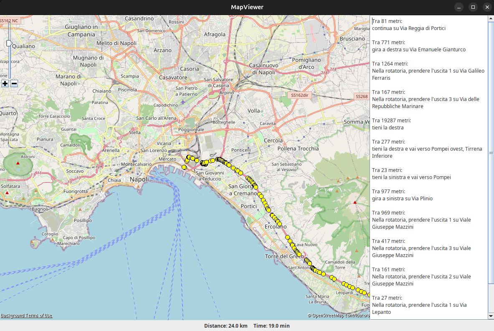

## RouteViewer - Viewing Routes on OpenStreetMap.

## Description.
RouteViewer is a Java application that uses **GraphHopper** to calculate routes between two points on an **OpenStreetMap (OSM)** based map. The paths found are then displayed on an interactive map using the **JMapViewer** library.

## Features.
- Calculation of the fastest route between two geographical coordinates.
- Displaying the route on the map with markers.
- Integration with GraphHopper for navigation data management.
- Use of JMapViewer to display OpenStreetMap in a Java window.

## Technologies Used.
- **Java**: Main programming language.
- **GraphHopper**: Routing engine based on OpenStreetMap.
- **JMapViewer**: Library for displaying OpenStreetMap maps in Java applications.
- **OSM (OpenStreetMap)**: Source of map data.

## Installation and Use.
### 1. Prerequisites.
- Java 8+ installed.
- Maven (optional, for dependency management).

### 2. Downloading OpenStreetMap data.
To use GraphHopper, you must download a `.osm.pbf` file of the region you are interested in. You can get these files from [Geofabrik](http://download.geofabrik.de/). Once you have downloaded the file, place it in the main folder of your project, then you can get started.

## Below are some comparative examples with Google maps.
### Test 1

### Test 2

## Credits.
- **GraphHopper**: [https://www.graphhopper.com/](https://www.graphhopper.com/)
- **OpenStreetMap**: [https://www.openstreetmap.org/](https://www.openstreetmap.org/)
- **JMapViewer**: [https://wiki.openstreetmap.org/wiki/JMapViewer](https://wiki.openstreetmap.org/wiki/JMapViewer)

